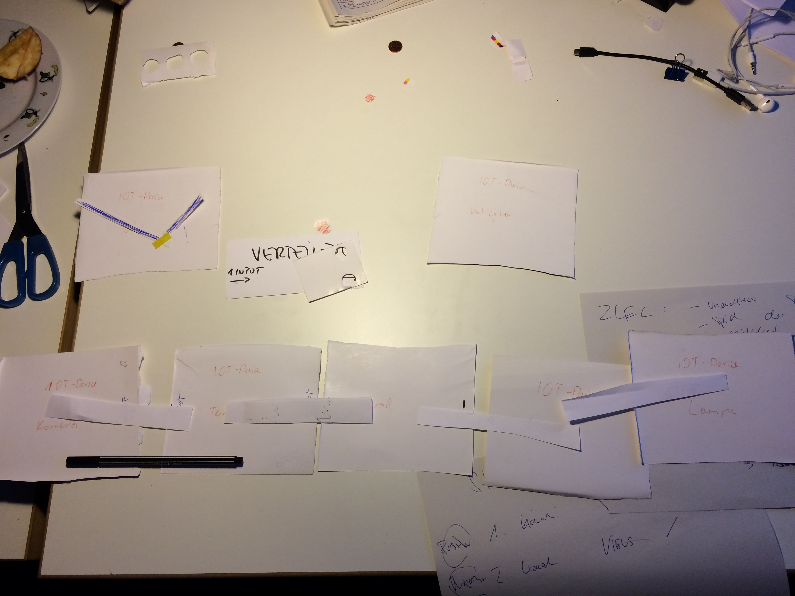

# X
X ist ein unbegrenzt erweiterbares, distribuiertes Netzwerk, das aus miteinander verbunden Boxen besteht.

## Bestandteile
### Firewall
- INPUT (1x)
- Lässt nur die positiven Signale durch und verhindert, das sich weitere Boxen mit einem Virus infizieren
- OUTPUT (1x)
### Verteiler
- INPUT (1x)
- Verteilt Signal auf zwei OUPUT
- OUTPUT (2x)
### IoT Devices
- INPUT (1x)
- AKTION / FEEDBACK / INPUT
- OUTPUT (1x)
## Schwierigkeiten
Eine Box kann sich unvorhersehbar mit einem Virus identifizieren. Die kann nicht verhindert werden, nur durch regelmäßiges installieren von Patches reduziert werden werden.
## Regeln
1. Es müssen mindestens zwei Boxen miteinander verbunden werden, damit die Boxen aktiv werden.
2. Jede Box besitzt einen Patch-Button. Dieser leuchtet gelegentlich auf, falls ein Patch verfügbar ist. Durch drücken des Knopfes wird das Patch installiert. Geschieht das nicht, wird die Box anfällig, von einer anderen Box oder durch sich selbst infiziert zu werden.
3. Ist eine Box von einem Virus infiziert, tritt eine wahrnehmbare Fehlfunktion auf, die sich je nach Bauart der Box widerspiegelt
4. Ist eine Box infiziert, werden nach 5 Sekunden alle direkt verbundenen Boxen infiziert.
5. Ist eine Box infiziert, kann durch betätigen des Patch-Buttons die ursprüngliche Funktion wieder hergestellt werden
## Ziel des Spiels
X ist ein unendliches Spiel. Ziel des Spiels ist es, möglichst viele Verbindungen herzustellen und neue Kombinationen zu entdecken, ohne das ein Botnet entstehen kann.

## Infizierung
Eine Box kann sich unvorhersehbar mit einem Virus identifizieren.
### Interne Infizierung
Die Box infiziert sich selbst, sie wird quasi von einem unsichtbaren Hacker infiziert. Der Virus kann sich auf andere Boxen ausbreiten
### Externe Infizierung
Eine Box wird von einer anderen Infizierten Box angesteckt. Falls diese mindestens 5 Sekunden verbunden sind.

## Patch-Status
Jede Box beinhaltet eine RGB LED, die in drei Farben anzeigt, wann das letzte Patch installiert ist:
### Grün
Es wurde gerade ein Patch installiert und die Box ist vor Infizierung geschützt.
### Orange
Das letzte Patch wurde vor 1 Minute installiert und die Box kann  nicht von außen infiziert werden, kann sich aber selbst infizieren.
### Rot
Das letzte Patch wurde vor 2 Minuten installiert und die Box ist nicht mehr vor Infizierung geschützt.
